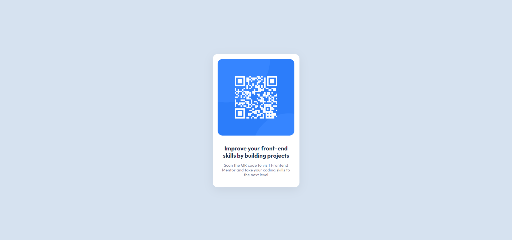
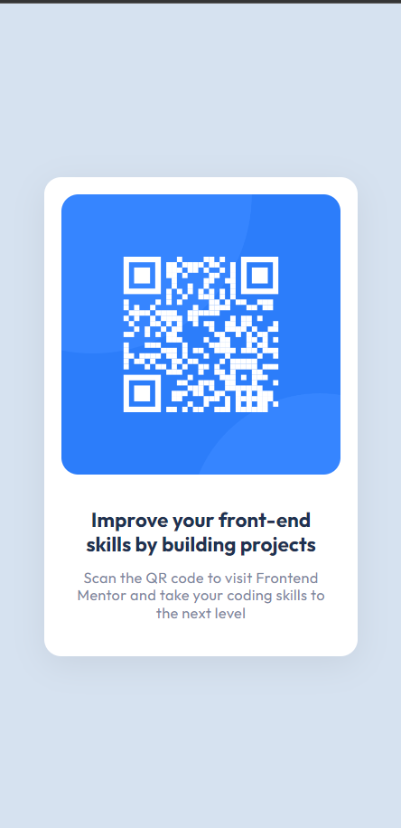

# Frontend Mentor - QR code component solution

This is a solution to the [QR code component challenge on Frontend Mentor](https://www.frontendmentor.io/challenges/qr-code-component-iux_sIO_H).
Frontend Mentor challenges help you improve your coding skills by building realistic projects.

## Overview

This solution was built using HTML and CSS.

   
  

<!-- ### Desktop view

### Mobile view

 -->

### Link

[TRY IT OUT](https://frontend-mentor-challenges-pi-smoky.vercel.app/)

### Built with

- Semantic HTML5 markup
- CSS custom properties
- Flexbox
- Mobile-first workflow

## Author

- Website - [Amin Awinti](https://www.linkedin.com/in/aminawinti/)
- Twitter - [@AminAwinti](https://twitter.com/AminAwinti)
